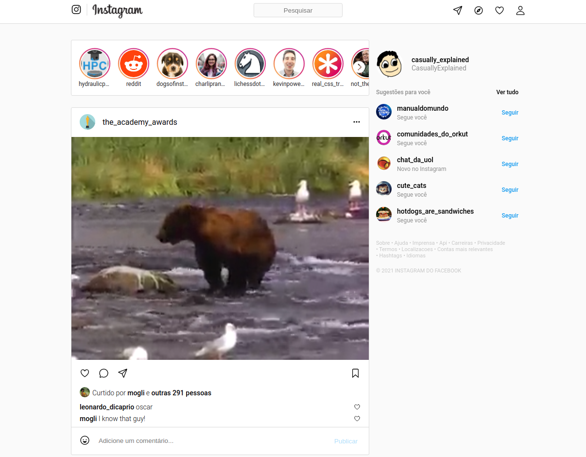

# Instagram Clone

The goal of this project is to clone the Instagram page. Several page elements were intentionally left out to make the project simpler to build. 
To achieve this, the project makes use of HTML5 and CSS3 only.

## Built With

- HTML5 , CSS3
- Windows, Linux

## Live Demo

[Live Demo Link](https://vitorelourenco.github.io/projeto_instagram/)

## Authors

👤 **Vitor Emanuel Lourenco**

- GitHub: [@vitorelourenco](https://github.com/vitorelourenco)
- Twitter: [@Vitorel](https://twitter.com/Vitorel)
- LinkedIn: [vitoremanuellourenco](https://www.linkedin.com/in/vitoremanuellourenco/)

## 🤝 Contributing

Contributions, issues, and feature requests are welcome!

Feel free to check the [issues page](https://github.com/vitorelourenco/projeto_instagram/issues).

## Show your support

Give a ⭐️ if you like this project!

## Acknowledgments

- Instagram (https://www.instagram.com/)
- RespondeAi (https://www.respondeai.com.br/)
- The Odin Project (https://www.theodinproject.com/)

## 📝 License

This project is [MIT](lic.url) licensed.

